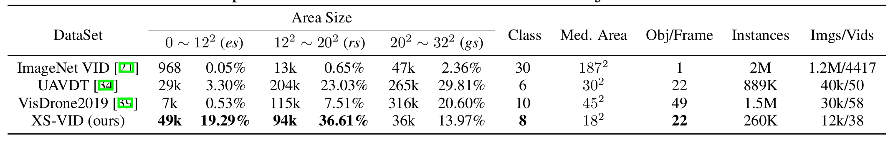

# XS-VID: An Extra Small Object Video Detection Dataset
XS-VID is a comprehensive dataset for Extra Small Object Video Detection, including diverse day and night scenes such as rivers, forests, skyscrapers, and streets.


## Update

- [20250303] We have provided a new download of XS-VIDv2 with the v1 data merged to form a new dataset, with a convenient command line download below!
- [20250301] We have released XS-VIDv2 containing 374 videos with 186446 frames for training 36478 frames for testing!
- [20241124] We will soon be releasing XS-VIDv2, incorporating many new videos and scenarios!
- [20241011] our paper released on **https://arxiv.org/abs/2407.18137**
- [20240811] Annotation in YOLO format released!
- [20240530] The quantitative results of several mainstream methods on XS-VID test-set are reported!
- [20240530] We add the visualization of images in XS-VID.
- [20240528] Our **[Homepage](https://gjhhust.github.io/XS-VID/)** for XS-VID benchmark opens!


## XS-VID
XS-VID contains a diverse array of scenes featuring multiple categories and sizes of targets. Notably, XS-VID achieves unprecedented breadth and depth in covering and quantifying minuscule targets (< $32^2$ pixels). Some example images are shown below.


Here is a statistical comparison of our dataset with other related datasets



## Results

We exhibit the quantitative experiment results of several representative methods on the XS-VID test-set and Visdrone2019 VID test-dev set as follows.


## Codes
The official codes of our benchmark, which mainly includes data preparation and evaluation, are released below.

- **our XS-VID baseline:** [YOLOFT](https://github.com/gjhhust/YOLOFT)
- VOD Method: [MMtracking](https://github.com/open-mmlab/mmtracking); [DiffusionVID](https://github.com/sdroh1027/DiffusionVID); 
- GOD Method: [MMdetection](https://github.com/open-mmlab/mmdetection)
- SOD Method: [CFINet](https://github.com/shaunyuan22/CFINet); [CEASC](https://github.com/Cuogeihong/CEASC)
- YOLO Method: [Ultralytics](https://github.com/ultralytics/ultralytics)；[StreamYOLO](https://github.com/yancie-yjr/StreamYOLO)
- Eval Tools:  [Eval code](https://github.com/gjhhust/XS-VID)


## Download
We provide the downloading of our datasets, You can download the full XS-VID dataset by choosing any of the following four choices.

### Download method1: huggingface
  
**Linux Command:**

```bash
pip install huggingface_hub && \
huggingface-cli download lanlanlan23/XS-VID --repo-type dataset --local-dir ./XS-VID && \
mkdir -p ./XS-VID/{annotations,images} && \
unzip -o ./XS-VID/annotations.zip -d ./XS-VID/annotations && \
find ./XS-VID -name 'videos_subset_*.zip' -exec unzip -o {} -d ./XS-VID/images \; && \
rm -f ./XS-VID/*.zip
```

**Windows Command (CMD):**

```bash
pip install huggingface_hub && ^
huggingface-cli download lanlanlan23/XS-VID --repo-type dataset --local-dir ./XS-VID && ^
mkdir "./XS-VID\annotations" && mkdir "./XS-VID\images" && ^
powershell -Command "Expand-Archive -Path './XS-VID/annotations.zip' -DestinationPath './XS-VID/annotations' -Force" && ^
for /r "./XS-VID" %f in (videos_subset_*.zip) do powershell -Command "Expand-Archive -Path '%f' -DestinationPath './XS-VID/images' -Force" && ^
del /f /q "./XS-VID\*.zip"
```


### Download method2: modelscope(Recommended for China)
  
**Linux Command:**

```bash
pip install modelscope && \
modelscope download --dataset lanlanlanrr/XS-VID --local_dir ./XS-VID && \
mkdir -p ./XS-VID/{annotations,images} && \
unzip -o ./XS-VID/annotations.zip -d ./XS-VID/annotations && \
find ./XS-VID -name 'videos_subset_*.zip' -exec unzip -o {} -d ./XS-VID/images \; && \
rm -f ./XS-VID/*.zip
```
**Windows Command (CMD):**

```bash
pip install modelscope && ^
modelscope download --dataset lanlanlanrr/XS-VID --local_dir ./XS-VID && ^
mkdir "./XS-VID\annotations" && mkdir "./XS-VID\images" && ^
powershell -Command "Expand-Archive -Path './XS-VID/annotations.zip' -DestinationPath './XS-VID/annotations' -Force" && ^
for /r "./XS-VID" %f in (videos_subset_*.zip) do powershell -Command "Expand-Archive -Path '%f' -DestinationPath './XS-VID/images' -Force" && ^
del /f /q "./XS-VID\*.zip"
```

### Expected Folder Structure
```
./XS-VID/
├── annotations/    # Annotation files
└── images/         # Video frames (extracted from videos_subset_*.zip)
```

### Notes
- The script will auto-delete ZIP files after extraction.
- Ensure sufficient disk space (~same as ZIP sizes + extracted content).

If you get an error while unpacking, you can get help from [issues](https://github.com/gjhhust/XS-VID/issues)

## Citation

If you find MovieChat useful for your your research and applications, please cite using this BibTeX:
```
@article{guo2024XSVID,
  title={XS-VID: An Extremely Small Video Object Detection Dataset},
  author={Jiahao Guo, Ziyang Xu, Lianjun Wu, Fei Gao, Wenyu Liu, Xinggang Wang},
  journal={arXiv preprint arXiv:2407.18137},
  year={2024}
}
```

## Support or Contact
If you have any problems about our XS-VID benchmark, please feel free to contact us at gjh_mhust@hust.edu.cn.
