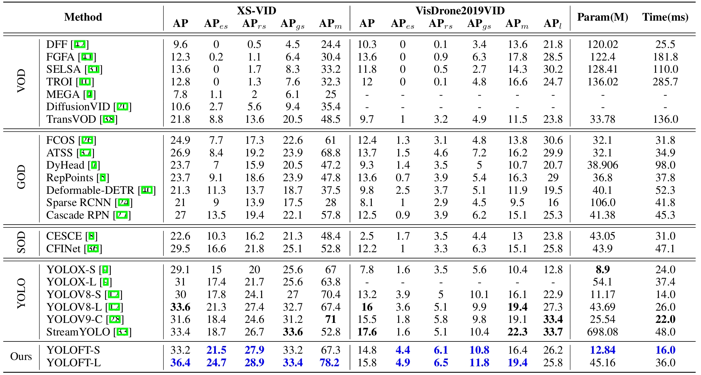

# XS-VID: An Extra Small Object Video Detection Dataset
XS-VID is a comprehensive dataset for Extra Small Object Video Detection, including diverse day and night scenes such as rivers, forests, skyscrapers, and streets.


## Update

- [20241124] We will soon be releasing XS-VIDv2, incorporating many new videos and scenarios!
- [20241011] our paper released on **https://arxiv.org/abs/2407.18137**
- [20240811] Annotation in YOLO format released!
- [20240530] The quantitative results of several mainstream methods on XS-VID test-set are reported!
- [20240530] We add the visualization of images in XS-VID.
- [20240528] Our **[Homepage](https://gjhhust.github.io/XS-VID/)** for XS-VID benchmark opens!


## XS-VID
XS-VID contains a diverse array of scenes featuring multiple categories and sizes of targets. Notably, XS-VID achieves unprecedented breadth and depth in covering and quantifying minuscule targets (< $32^2$ pixels). Some example images are shown below.


Here is a statistical comparison of our dataset with other related datasets


## Results

We exhibit the quantitative experiment results of several representative methods on the XS-VID test-set and Visdrone2019 VID test-dev set as follows.



## Download
We provide the downloading of our datasets.

- [Google drive]： [annotations](https://drive.google.com/file/d/1-MF_H6OnLL-6ZAHwmwTOdxIeKY9zqGO9/view?usp=sharing); [images(0-3)](https://drive.google.com/drive/folders/1EGTIWLCLUAlKfbq7KEeHqXL8PAyKHNQ_?usp=sharing); [images(4-5)](https://drive.google.com/drive/folders/1a6E-7YI-rwSDOtjqzRf_E0leYXSNtjaW?usp=sharing);
- [BaiduNetDisk]：[annotations and images](https://pan.baidu.com/s/1MHPF2ajDvq2y4_nTYQG3yA?pwd=tzdx);

Please choose a download method to download the annotations and all images. Make sure all the split archive files (e.g., `images.zip`, `images.z01`, `images.z02`, etc.) are in the same directory. Use the following command to extract them:
```bash
unzip images.zip
unzip annotations.zip
```
If you get an error while unpacking, you can get help from [issues](https://github.com/gjhhust/XS-VID/issues)

## Codes
The official codes of our benchmark, which mainly includes data preparation and evaluation, are released below.

- **our XS-VID baseline:** [YOLOFT](https://github.com/gjhhust/YOLOFT)
- VOD Method: [MMtracking](https://github.com/open-mmlab/mmtracking); [DiffusionVID](https://github.com/sdroh1027/DiffusionVID); 
- GOD Method: [MMdetection](https://github.com/open-mmlab/mmdetection)
- SOD Method: [CFINet](https://github.com/shaunyuan22/CFINet); [CEASC](https://github.com/Cuogeihong/CEASC)
- YOLO Method: [Ultralytics](https://github.com/ultralytics/ultralytics)；[StreamYOLO](https://github.com/yancie-yjr/StreamYOLO)
- Eval Tools:  [Eval code](https://github.com/gjhhust/XS-VID)

## Citation

If you find MovieChat useful for your your research and applications, please cite using this BibTeX:
```
@article{guo2024XSVID,
  title={XS-VID: An Extremely Small Video Object Detection Dataset},
  author={Jiahao Guo, Ziyang Xu, Lianjun Wu, Fei Gao, Wenyu Liu, Xinggang Wang},
  journal={arXiv preprint arXiv:2407.18137},
  year={2024}
}
```

## Support or Contact
If you have any problems about our XS-VID benchmark, please feel free to contact us at gjh_hust@hust.edu.cn.
